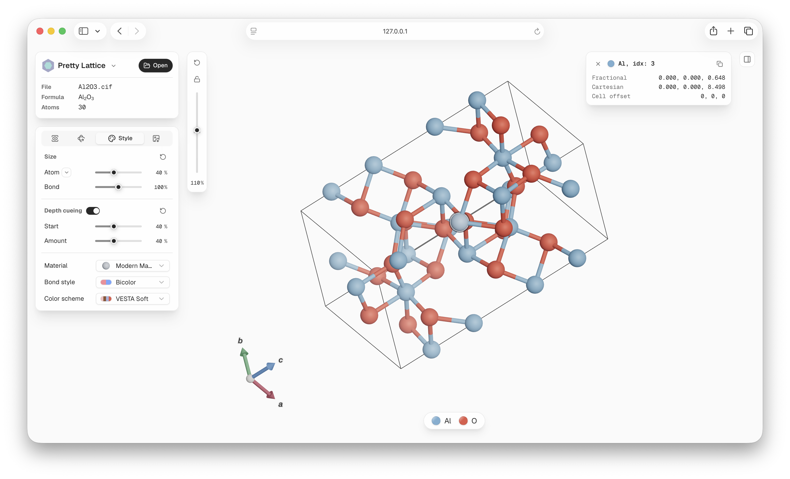
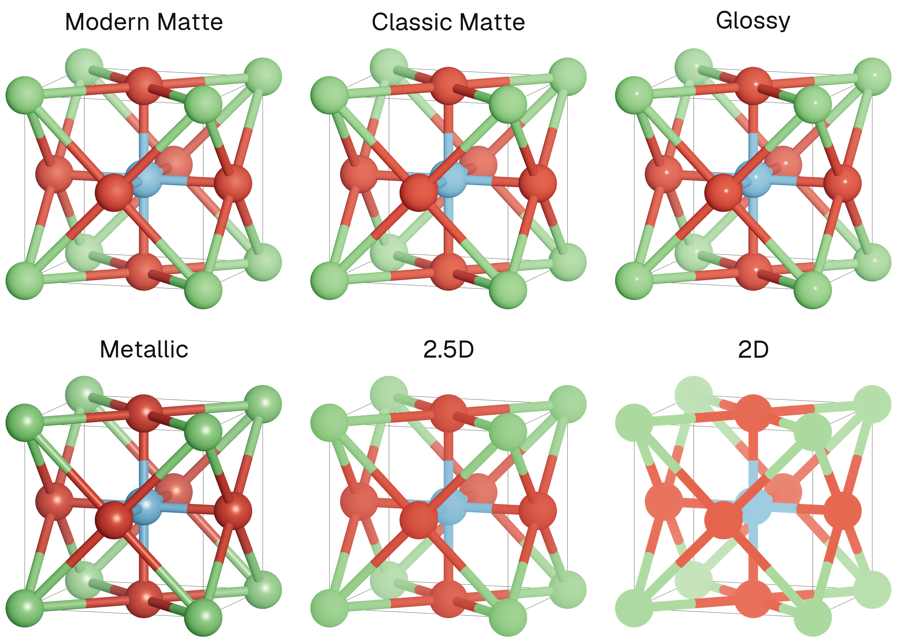
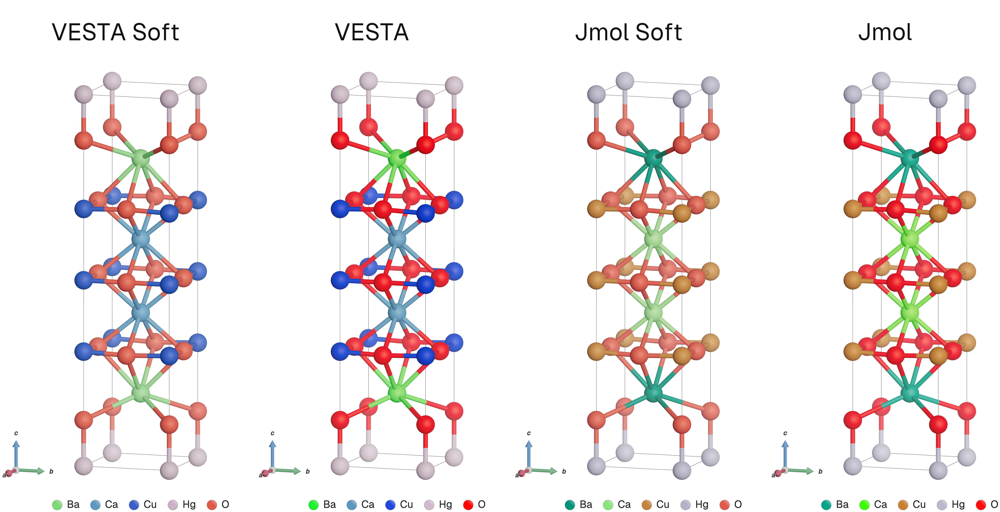
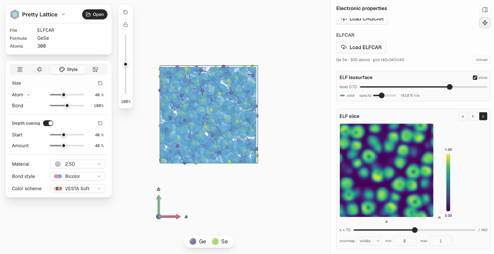
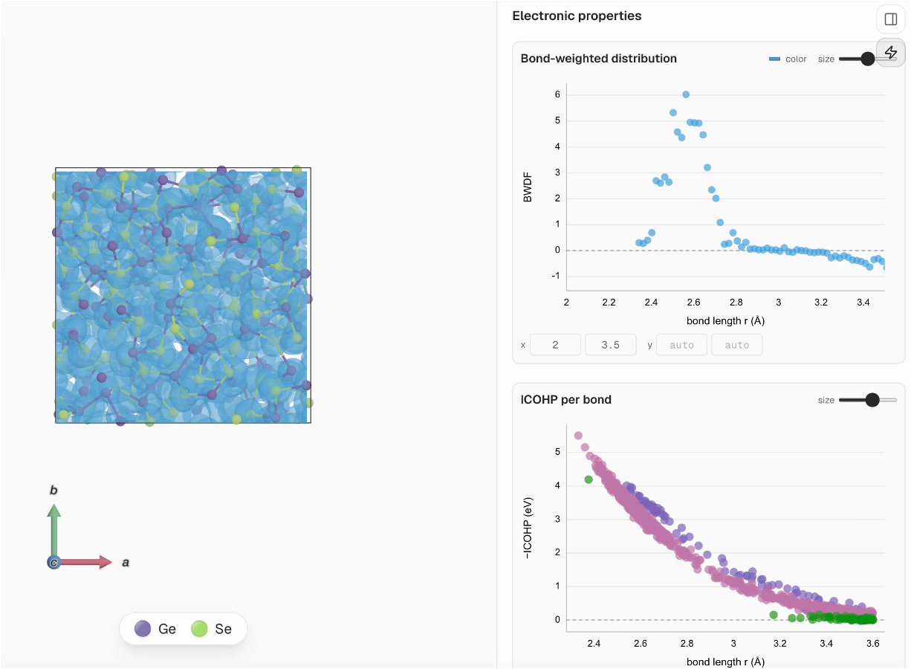

<h1 align="center">Glance</h1>

<p align="center">
  Glance 是一个晶体结构可视化工具，用来快速做出美观、适合发表的结构图。
</p>
<p align="center">
  <a href="https://github.com/songfeitong/pretty-lattice/actions/workflows/ci.yml"></a>
  <a href="https://pypi.org/project/pretty-lattice/"></a>
  
  
</p>


<p align="center">
  <a href="README.md">English</a> | 简体中文
</p>

> 本项目是原项目 [pretty-lattice](https://github.com/songfeitong/pretty-lattice)
> (作者 [@songfeitong](https://github.com/songfeitong))的扩展 fork。晶体**可视化**核心来自上游项目;
> 本 fork 增加了**轨迹可视化**、**结构分析**与**电子性质分析**。详见[致谢](#致谢)。

- **美观**：内置更现代美观的颜色、材质、光照和景深效果
- **易用**：在浏览器里加载、预览和导出结构，直观易用的用户界面
- **可靠**：结构文件读取和分析基于成熟的 [pymatgen](https://github.com/materialsproject/pymatgen)
- **可扩展**：上万原子的结构也能流畅交互
- **灵活**：颜色、半径、材质、透明度、视角和导出参数都可以按需要修改

<p align="center">
  
</p>


## 为什么做 Glance

我一直觉得想画出一张好看的晶体结构图很难。

传统的晶体学工具（比如 VESTA）功能确实强大，但默认的视觉效果总让人觉得过时。辣眼睛的配色、粗糙的3D效果，往往得花大量时间手动调整，画面才算勉强能看。当然，另一种选择是把结构导入像 Cinema 4D 或 Blender 这类专业 3D 软件里渲染，可那样又显得大炮打蚊子，而且学习曲线要陡峭得多。

Glance 就是我为弥补二者之间的空白空缺所做的尝试。它基于 Three.js 构建，在相对轻量的同时保证高质量的画面。它提供了一个现代直观的用户界面，以及研究者熟悉的操作方式，开箱即用，直出干净又美观的晶体图。

> [!NOTE]
> 从设计的初衷开始，Glance 就专注于**可视化**。它并不打算取代 VESTA、Materials Studio 这类成熟的材料分析工具，也不打算提供复杂的结构编辑或分析流程。打开的结构文件会被当作只读文件来处理。更推荐的工作方式是先用更专业的工具准备和分析结构，再把最终结构导入 Glance 里查看、调整样式并导出图片。

## 安装

> [!IMPORTANT]
> 本 fork 新增的模块（轨迹、结构分析、电子性质）**没有发布到 PyPI**。`pip install pretty-lattice`
> 装的是上游发布版，不含这些功能。要获取此版本，请按下面的方式从本仓库安装。

从本仓库安装最新版（打包时已内置构建好的前端，无需 Node/bun 构建步骤）：

```shell
pip install git+https://github.com/Xqd9912/glance.git
```

或用 [uv](https://github.com/astral-sh/uv) 作为独立工具安装：

```shell
uv tool install git+https://github.com/Xqd9912/glance.git
```

上游的 PyPI 发布版（仅含可视化核心）仍可用 `pip install pretty-lattice` /
`uv tool install pretty-lattice` 安装。

运行环境：

- Python 3.12+
- macOS、Linux 或 Windows
- 任意现代浏览器

## 快速开始

安装后，启动本地图形界面：

```shell
glance gui
```

Glance 会启动一个本地服务，并自动打开浏览器。

也可以不安装，临时运行：

```shell
uvx --from git+https://github.com/Xqd9912/glance.git glance gui
```

常用启动选项：

```shell
glance gui --no-open     # 只启动服务，不自动打开浏览器
glance gui -p 0          # 自动选择可用端口
```

## 示例

### 材质预设

<p align="center">
  
</p>

### 配色预设

<p align="center">
  
</p>

### 原子选择与周期展示

可以选择单个原子或整类元素，仅显示或隐藏所选集合，并在 a/b/c 三个晶格方向按带符号范围
复制周期晶胞。预览、化学键、多面体、晶胞网格和图片导出会使用同一份筛选与复制结果。

右侧紧凑 Ruler 工具提供单次键长、任意两点距离、键角和二面角测量，点选顺序与当前数值
统一显示在右上角信息卡。原子属性（总配位数、按邻居
元素配位数、成键距离统计以及轨迹相对第 0 帧位移）可用于实时筛选，或映射到
Viridis、Plasma、Cividis、Coolwarm 色标；测量几何与标量图例会进入图片导出。显示预设以
唯一名称在
浏览器本地保存组件、周期范围、相机、样式、光照、标签与预览质量，并支持带版本号的 JSON
导入导出。

### 轨迹可视化

读取 VASP `XDATCAR`、LAMMPS `.dump` 或 `.xyz` 轨迹，用内置播放器逐帧查看。对于只带原子类型
的 dump 文件，可以随时把类型映射到真实元素，每一帧都复用相同的渲染与成键设置。

<p align="center">
  
</p>

### 结构分析

在指定帧范围上计算结构与动力学描述符，并用交互式图表查看：对分布函数 g(r)、配位数、键角分布、
序参数、环统计、均方位移（总体与分元素）以及 ALTBC。成键 cutoff 会自动取每条 g(r) 的第一个极小值作为
初值，可在计算配位数相关量之前手动调整。环统计在成键网络上计算本原环（最短路径环），同时给出多帧
平均的环尺寸分布（柱状图）与逐帧的分布范围（box-plot）。

<p align="center">
  
</p>

<p align="center">
  
</p>

### 电子性质

分析并可视化 VASP 的电子结构输出：

- **电荷密度（`CHGCAR`）**——将电子密度渲染成真正的 3D 等值面，叠加在原子与化学键上
  （复用结构渲染器），等值面 level、颜色、透明度均可调；还可以查看正交密度切片，以及
  低电子密度（LED）分布及其分数（0.22 是相变材料的经验阈值）。
- **电子局域化（`ELFCAR`）**——复用 `CHGCAR` 的体数据流程（等值面、切片）处理 ELF，
  数值保持原始 `[0, 1]` 范围，并给出网格上 ELF 值的统计分布曲线。
- **成键路径分布（`CHGCAR`/`ELFCAR`）**——先选第一个原子，第二个原子从其截断半径内的
  近邻中选取（按键长从近到远列出），绘制沿两者连线、在一个细圆柱体内平均的 ELF 或电荷
  随距离的变化曲线。圆柱半径可调（默认 0.5 Å），使平均值保持在成键通道内、不受邻近原子干扰。
- **LOBSTER 成键分析**——将键权重分布函数（`BWDF.lobster`）与积分晶体轨道
  哈密顿/重叠布居（`ICOHPLIST.lobster`、`ICOOPLIST.lobster`）随键长绘制成散点图，
  散点大小/颜色可调，并可按元素对（如 Ge–Ge、Ge–Se、Se–Se）用复选框筛选显示。
- **态密度（`TDOS.dat`）**——绘制总态密度的能量–DOS 折线图。
- **统一电子结构（`vasprun.xml`）**——从同一数据源按实际可用内容读取 TDOS、元素/轨道
  PDOS、元素×轨道 PDOS 与 IPR；可将当前 Select 快照作为单原子或多原子组 PDOS，并选择
  Sum 或 Average。
- **逆参与比**——为每条能带计算 k 点加权的原子组成与聚合局域化指标
  （对仅 Γ 点计算即为常规态 IPR），与 DOS 共用能量轴绘制；选择能带后，还可按累计组成
  或 Top K 将主结构切换为该态的主要原子团簇。

<p align="center">
  
</p>

<p align="center">
  
</p>

<p align="center">
  
</p>

<p align="center">
  
</p>

## 致谢

本项目的晶体**可视化**基础——Three.js/React 渲染、材质、配色、相机与取向控制、元素图例、图像导出——
来自原项目 [pretty-lattice](https://github.com/songfeitong/pretty-lattice)
(作者 [@songfeitong](https://github.com/songfeitong),MIT License 发布),这部分工作的功劳归原作者。

本 fork 在其基础上增加了:

- **轨迹可视化**——读取 VASP `XDATCAR`、LAMMPS `.dump`、`.xyz` 轨迹并逐帧播放,复用相同的渲染与统一成键设置。
- **结构分析**——对分布函数 g(r)、配位数、键角分布、序参数、环统计、MSD、ALTBC,并提供交互式图表。
- **电子性质分析**——CHGCAR 电荷密度与 ELFCAR 电子局域化的 3D 等值面、切片与分布,
  沿原子对的成键路径分布,LOBSTER 的 BWDF/ICOHP/ICOOP 成键散点图,TDOS.dat 态密度,
  以及 vasprun.xml 的逆参与比（IPR）与 DOS 共用能量轴。
- **原子选择与周期展示**——按原子或元素筛选结构，并在带符号的晶格范围内复制周期晶胞；
  预览与导出保持一致。
- **测量、属性视图与显示预设**——单结果几何检查、基于属性的实时染色/筛选，以及本地版本化
  显示预设。
- **自定义元素对成键 cutoff**,以及周期性边界跨 cell 成键的修复。

## 许可证

Glance 使用 [MIT License](LICENSE) 发布(继承自上游项目)。
