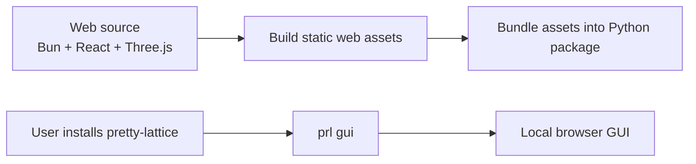
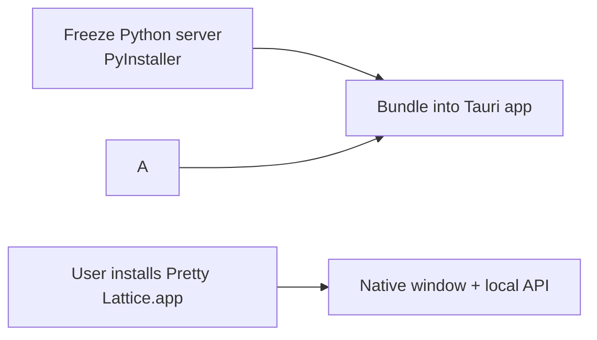

# Project Constitution

## Product Definition

Pretty Lattice is a **local web GUI tool** for interactive preview and rendering crystal structures as pretty, publication-ready figures.

The workflow is simple:

```text
open a structure file 
→ preview it interactively 
→ adjust visual parameters and layouts 
→ export a high-quality figure
```

## Why

Crystal workbenches like VESTA are useful and powerful, but on the visualization and figure side, they feel somewhat outdated. The figures often don’t really feel like they belong to the 2020s. You can tweak them, but it rarely feels enough.

For better visuals, people sometimes turn to C4D or Blender. But personally, I’m reluctant to learn these heavy industry tools just to make a nice crystal figure. It feels like overkill for the task.

So I decided to build a lightweight tool based on modern web tech (Three.js), that can generate pretty, publication-ready figures out of the box, while still being highly configurable and providing a smooth interactive preview.

## Principles

- Easy to use: WYSIWYG. Easy to navigate. Intuitive interaction.
- Yet powerful:  more control and configurations (on the visual side) than VESTA. 
- Publication-ready:  this project is driven by my own need for publication-ready figures.
- Focused:  Focused on viewing and rendering.  Read-only on structure file. Prepare elsewhere.
- Modern: modern UI/UX, modern tech stack, modern asetetics.

## Release Shape

Pretty Lattice ships in two shapes. Both run the same Python backend and the same web
frontend; they differ only in what the user has to install and where the UI is drawn.

**Python package.** Users install `pretty-lattice` and run `prl gui`. This starts a local
Python server and opens a browser page, which runs the bundled web app.



**Desktop app.** Users install a normal application and double-click it. The Python server
is frozen with PyInstaller and shipped inside the app, which runs it as a child process and
draws the UI in a native window. See [Desktop App](desktop.md).



Users should **not need JS developer tools** (Node, Bun, pnpm, Vite, etc.). Users of the
desktop app should not need **Python** either.

The desktop app is an additional shape, not a replacement: the `pip install` + `prl gui`
path stays supported, and no change should break it.

## Tech Stack

Pretty Lattice keeps a clear backend/frontend boundary. The Python backend owns structure IO, materials analysis, and scene generation. The Web frontend owns visual interaction and rendering. The browser may use lattice-derived scene data for camera and view controls, but crystallographic or materials-analysis decisions should stay in Python unless they are purely presentational.

### Backend: Python

Responsibilities:

- Read crystal structure files such as CIF and POSCAR.
- Run materials analysis, including bonding, polyhedra, and symmetry.
- Convert analyzed structures into scene specifications for the Web app.
- Serve the local GUI and API.

Stack:

- Dev tools: uv, pytest, ruff
- FastAPI + Uvicorn
- Typer
- Pymatgen
- Numpy

### Frontend: Web

Responsibilities:

- Render and interact with the scene returned by the backend.
- Handle camera, lighting, materials, visual parameters, and browser export.
- Keep UI state and controls close to the visual workflow.

Stack:

- Dev tools: Bun, Vite
- Front-end framework: React
- UI: Tailwind CSS, shadcn/ui, Radix, lucide
- 3D: Three.js + React Three Fiber
