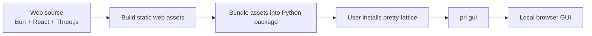

# Project Constitution

## Product Definition

Pretty Lattice is a **local web GUI tool** for rendering crystal structures as pretty, modern, publication-ready figures.

The intended workflow is simple:

```text
open a structure file → preview it interactively → adjust visual parameters and layouts → export a high-quality figure
```

## Principles

- Minimal: read-only structure rendering. Prepare elsewhere; render here.
- Modern: modern stack, modern web interface, modern figures.
- Easy: WYSIWYG preview and adjustment.
- Professional: publication-ready figures.

## Release Shape

Users install a Python package and launch a local GUI:

```bash
uv tool install pretty-lattice
prl gui
```

or, with another Python package installer:

```bash
pipx install pretty-lattice
prl gui
```

The command starts a local Python server and opens a browser page. The browser runs the bundled web app and uses Three.js/WebGL for rendering.



Normal users should only need:

- Python
- a modern browser
- the `pretty-lattice` package

They should **not** need to install Bun, Node, pnpm, or Vite.

## Tech Stack

### Python side

Responsibilities:

- read crystal structure files (e.g. CIF, POSCAR)
- convert structures into a scene specification
- serve the local web GUI
- expose local API endpoints for the frontend

Tools:

- Python 3.12
- `uv`
- FastAPI + Uvicorn
- Typer
- ASE
- `numpy`
- `pytest`, `ruff`

### Web side

Responsibilities:

- interactive preview
- camera/view control
- lighting and material presets
- visual parameter tuning
- PNG export from the browser

Tools:

- Bun
- Vite
- TypeScript
- React
- Tailwind CSS
- shadcn/ui
- Radix UI primitives
- lucide-react
- Three.js
- React Three Fiber

## Project Boundary

### In scope

- local web GUI
- structure loading through Python
- ball-and-stick rendering
- unit cell rendering
- orthographic camera
- lighting/material presets
- limited visual controls
- PNG export from GUI
- Python package with bundled frontend assets

### Out of scope for now

- full CLI rendering workflow
- headless batch export
- SVG/vector export
- public hosted web app
- complex editing of crystal structures
- large feature-complete VESTA replacement
