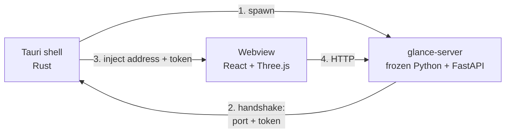

# Desktop App

Glance also ships as a native desktop app, built with [Tauri](https://tauri.app).
It is the same product as `glance gui`, packaged so that users do not need Python at all.

## How it fits together

The analysis backend is built on pymatgen, numpy and numba. None of that can run in a
browser, and rewriting it in Rust is not on the table. So the desktop app keeps the Python
server and runs it as a child process, called a *sidecar*:



1. The shell spawns the server. The server binds a free port, mints a one-off API token, and
   prints both on one stdout line prefixed with `GLANCE_READY`.
2. The shell waits until that port accepts connections. A splash window covers the wait,
   which is a few seconds, mostly spent importing pymatgen.
3. The shell creates the main window, injecting `window.__GLANCE_API__` before any
   application code runs.
4. The page talks to the server over plain HTTP on localhost.

Three consequences worth knowing:

- **The frontend cannot use relative `/api/...` paths in the desktop app.** The page is
  served by the app, not by the server, so a relative path would point back at the webview.
  Everything goes through `apiFetch` in [web/src/api/runtime.ts](../web/src/api/runtime.ts),
  which is a no-op in the browser and prefixes the real address in the desktop app.
- **The API requires a token in the desktop app.** A local HTTP server is reachable by every
  other process on the machine; the per-launch token means only the app's own window can
  drive it. `glance gui` passes no token, because there the page and the API share an origin.
- **The frontend cannot download files in the desktop app.** A webview is not a browser: with
  no download handler registered, WKWebView cancels an `<a download>` navigation outright and
  WebView2 drops the file into the download folder unannounced. Either way the user never
  chooses where it lands, and a failure looks exactly like a dead button. So every export goes
  through `saveBlob` in [web/src/export/saveFile.ts](../web/src/export/saveFile.ts), which
  keeps the link for the browser and hands the bytes to the shell's `save_export_file` command
  on the desktop. That command opens a native "Save as" dialog and writes the file itself.

  The bytes travel as a raw IPC body rather than as a JSON argument, because exports reach
  tens of megabytes and a byte array in JSON costs about four times that. The file name rides
  along in the `x-glance-file-name` header, percent-encoded so non-ASCII names survive.

## Prerequisites

On top of the usual `uv` and `bun`:

- **Rust**, via [rustup](https://rustup.rs). Tauri's shell is a Rust program.
- **macOS**: Xcode Command Line Tools (`xcode-select --install`).
- **Windows**: the MSVC C++ build tools and WebView2 (WebView2 is present on Windows 11 and
  on any up-to-date Windows 10).

## Running it in development

```bash
uv run --group desktop python scripts/build_sidecar.py   # once; see the note below
cd web
bun run desktop:dev
```

In a debug build the shell does **not** use the frozen server. It runs
`uv run python -m glance.desktop` straight from the working tree, so changes to
Python code take effect on the next launch without re-freezing anything. You still need to
have built the sidecar once, because the bundle configuration expects the directory to
exist.

## Building the installers

```bash
uv run --group desktop python scripts/build_sidecar.py
cd web
bun run desktop:build
```

Output lands in `web/src-tauri/target/release/bundle/` — `.dmg` and `.app` on macOS, `.msi`
and an NSIS `.exe` on Windows.

**PyInstaller cannot cross-compile.** Each platform's installer has to be built on that
platform. [.github/workflows/desktop.yml](../.github/workflows/desktop.yml) does this for
macOS (Apple Silicon and Intel) and Windows; it runs on a `v*` tag or on demand.

## Bundle size

The frozen server is around 330 MB, which dominates the installer. That is the cost of
shipping pymatgen's scientific stack: llvmlite alone (which numba needs) is 130 MB, and
scipy is another 83 MB.

[packaging/prl_server.spec](../packaging/prl_server.spec) excludes matplotlib, plotly,
sympy and a few others — roughly 100 MB of pymatgen's transitive dependencies that none of
the server's code paths actually reach.

Note what is **not** excluded, and why: pymatgen's LAMMPS dump reader is built on pandas,
and `ase` is reachable from the trajectory readers. Both are imported lazily, inside
functions, so neither the import graph nor a smoke test of startup will tell you they are
needed. `scripts/build_sidecar.py` launches the frozen server and waits for its handshake
for exactly this reason, and it is worth exercising the trajectory, isosurface and analysis
endpoints against a frozen build before shipping one.

## Signing

The builds are unsigned. On macOS that means Gatekeeper will refuse to open the app on a
machine that did not build it; the user has to right-click and choose Open, or clear the
quarantine attribute:

```bash
xattr -cr "/Applications/Glance.app"
```

Shipping this to other people properly means an Apple Developer ID and notarization on
macOS, and a code-signing certificate on Windows. Neither is set up.
